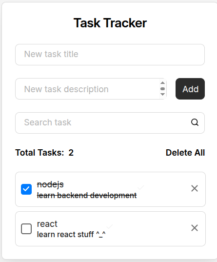

# Project Title

A brief, one-sentence description of the project and its purpose.

## Table of Contents
- [Overview](#overview)
- [Tech Stack](#tech-stack)
- [Prerequisites](#prerequisites)
- [Installation and Setup](#installation-and-setup)
- [Usage](#usage)
- [Project Structure](#project-structure)
- [Contributing](#contributing)
- [License](#license)

## Overview
This is a full-stack application built using a monorepo (with separate client/server folders) structure. The frontend is built with React and Vite, utilizing TypeScript for type safety. The backend is an Express server running on Node.js with TypeScript, connected to a PostgreSQL database.

Key features include:
*   CRUD Functionalite
*   Adding tasks
*   Deleting Tasks
*   ... (and much more)

## Tech Stack
*   **Frontend**: React, Vite, TypeScript
*   **Backend**: Node.js, Express, TypeScript
*   **Database**: PostgreSQL

## Prerequisites
Ensure you have the following installed on your local machine:
*   [Node.js](nodejs.org) (version X.X or higher)
*   [npm](www.npmjs.com) (usually comes with Node.js)
*   [PostgreSQL](www.postgresql.org) (or use Docker as described in setup)
*   [Git](git-scm.com)

## Installation and Setup
Follow these steps to get the development environment running locally:

1.  **Clone the repository:**
    ```bash
    git clone github.com
    cd your-project-name
    ```

2.  **Environment Variables:**
    Create a `.env` file in the root directory (and also possibly in `client` and `server` folders depending on your structure). Copy the contents from the `example.env` file and update the variables with your local database credentials and other secrets.
    *   `DB_USER=your_user`
    *   `DB_PASSWORD=your_password`
    *   `DB_HOST=localhost` (or `db` if using Docker)
    *   `DB_PORT=5432`
    *   `DB_NAME=your_database_name`

3.  **Database Setup (using Docker is recommended):**
    If using Docker, you can use a `docker-compose.yml` file to spin up a local Postgres instance.
    ```bash
    # Example docker-compose.yml content:
    version: '3.8'
    services:
      db:
        image: postgres:latest
        ports:
          - "5432:5432"
        environment:
          POSTGRES_USER: your_user
          POSTGRES_PASSWORD: your_password
          POSTGRES_DB: your_database_name
    ```
    Run: `docker-compose up -d`

    **Alternatively, if you have PostgreSQL installed locally:** Ensure your PostgreSQL server is running and create the specified database.

4.  **Install Dependencies:**
    Navigate to both the client and server directories to install dependencies.
    ```bash
    cd client
    npm install
    cd ../server
    npm install
    cd ..
    # If using a monorepo with workspaces, run npm install from the root
    ```

5.  **Run Database Migrations/Seeding (if applicable):**
    (e.g., using Prisma or TypeORM commands)
    ```bash
    # Example for Prisma
    cd server
    npx prisma migrate dev --name init # creates database schema
    npx prisma generate # generates client
    # npm run db:seed # Optional: run seed script if available
    cd ..
    ```

## Usage
*   **Start the development servers:**
    In separate terminal windows, run the following commands:
    *   **Frontend:**
        ```bash
        cd client
        npm run dev
        ```
        The client app will be running at `http://localhost:3000` (or the port specified in your Vite config).
    *   **Backend:**
        ```bash
        cd server
        npm run dev # or npm run start:dev which might use nodemon/ts-node
        ```
        The API server will be running at `http://localhost:5000` (or your specified port).

*   **API Endpoints:**
    *(Optional: Briefly list key endpoints or link to API documentation/Swagger here)*

## Project Structure
*(Optional: Outline the main folders and their purposes, especially if it's a monorepo)*
*   `/client`: Contains the React/Vite frontend application.
*   `/server`: Contains the Node/Express backend application.
*   `/shared`: (If applicable) Shared TypeScript types/interfaces between client and server.

## Contributing
Mention guidelines for contributing, e.g., "Fork the repo and submit a pull request."

## License
[Specify your project's license]

